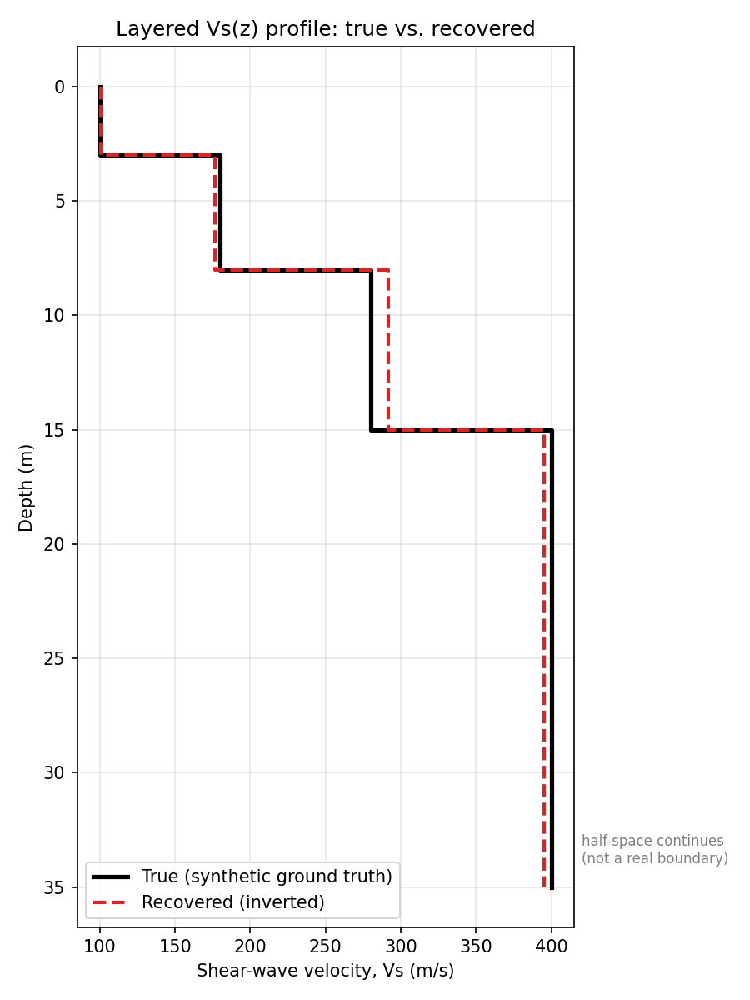
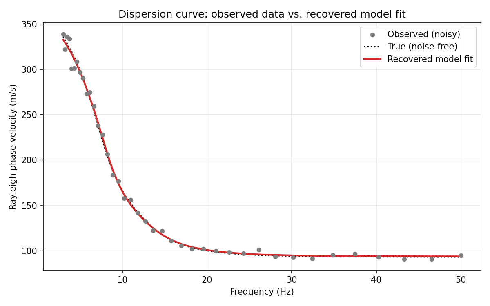
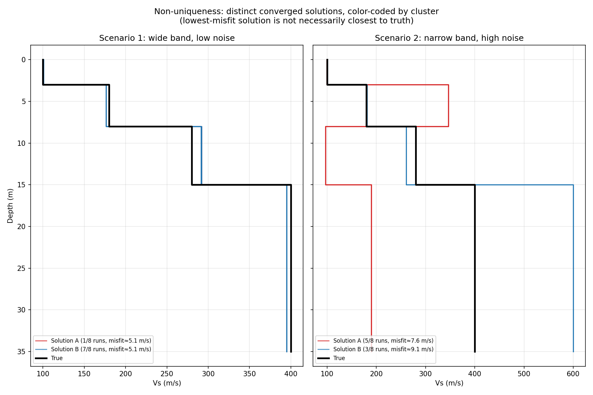
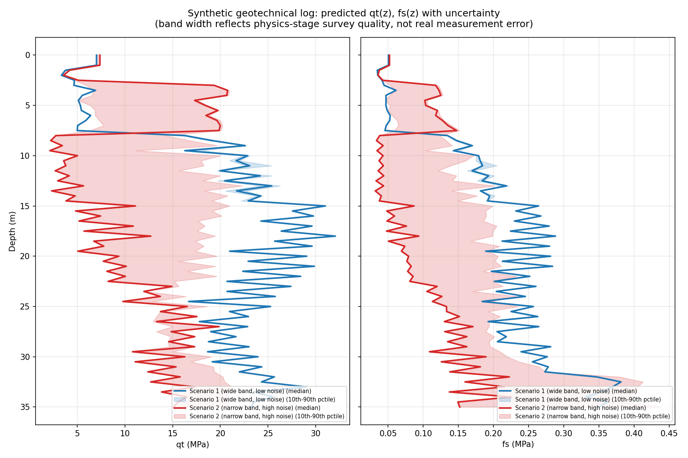
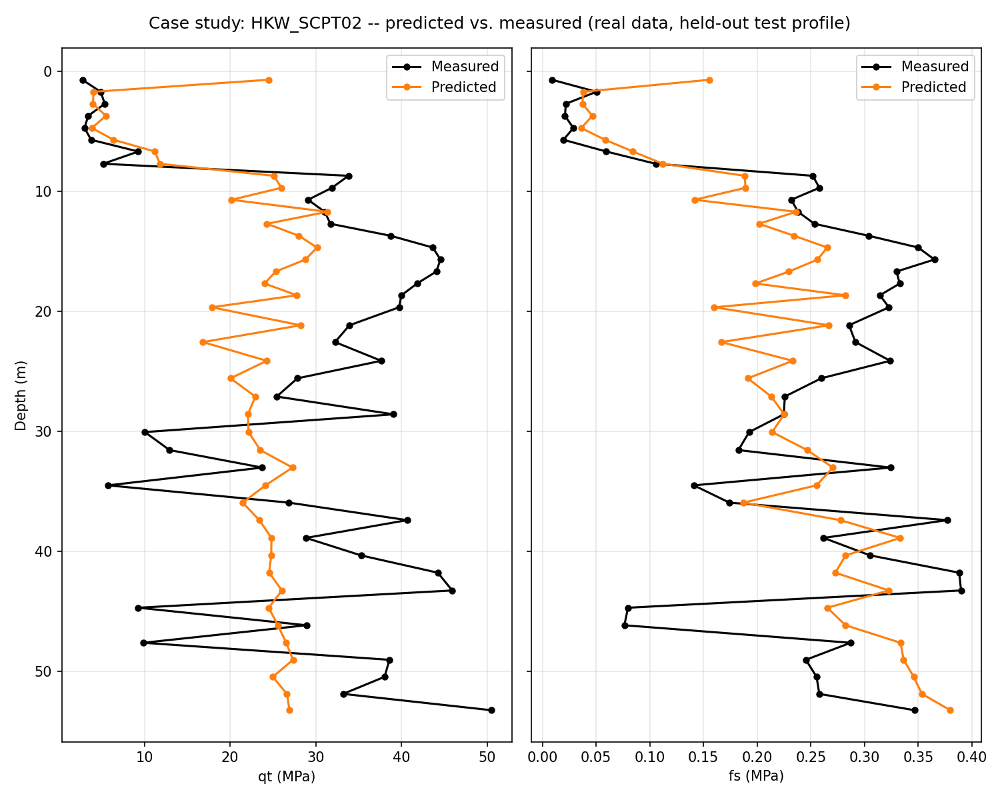

# Geophysical-to-Geotechnical Inversion Toolkit

A hybrid physics + machine learning pipeline for estimating offshore geotechnical parameters from geophysical data — grounded in professional experience in geophysical inverse theory for seabed characterization.


## Motivation

Offshore CPT and borehole campaigns for seabed characterization are expensive and slow. This is a growing bottleneck for deep-sea mineral exploration, where terrain is often sparsely characterized geotechnically. This toolkit explores whether **geophysical data can be inverted, and subsequently used, to estimate geotechnical parameters** as a cheaper complement to direct in-situ testing.

## Pipeline

1. **Physics stage** (`src/physics/`) — synthetic layered-earth model → Rayleigh-wave dispersion forward modeling (`disba`) → noise injection → global-optimization inversion to recover Vs(z), with explicit characterization of inversion non-uniqueness under different survey conditions.
2. **ML stage** (`src/ml/`) — XGBoost regressors, trained on real published seismic-CPTu data (Marín-Moreno et al. 2026), predicting cone resistance (*qt*) and sleeve friction (*fs*) from Vs and depth. Five experimental variants tested and documented (`src/ml/experiments/`).
3. **Integration stage** (`src/integration/`) — chains the physics stage's Vs ensemble (with uncertainty) through the ML stage's trained models, plus a case study validating predictions against a real, held-out measured profile.

**Main deliverable:** `notebooks/inversion_toolkit.ipynb` — the full narrated pipeline, runnable end to end.

## Tools

| Tool | Role in this project |
|---|---|
| [**disba**](https://github.com/keurfonluu/disba) | Rayleigh-wave dispersion forward modeling (Thomson-Haskell/Dunkin propagator-matrix method) — Stage 1 |
| **scipy** (`differential_evolution`) | Global-optimization inversion of the dispersion curve — Stage 1 |
| **XGBoost** | Gradient-boosted regressors and classifier — Stage 2 |
| **Optuna** | Bayesian (TPE) hyperparameter search across all trained models — Stage 2 |
| **scikit-learn** | Train/test splitting, cross-validation utilities, evaluation metrics | 
| **pandas / numpy** | Data loading, cleaning, feature engineering throughout |
| **matplotlib** | All figures |
| **Jupyter** | Integrated notebook deliverable |
| **shap** | Installed for planned model-interpretability analysis (see Future Work) |

## Key figures

**Physics stage — recovering a known Vs profile from a noisy dispersion curve:**





**Physics stage — non-uniqueness under degraded survey conditions:**



**Integration stage — uncertainty propagation and a real-data accuracy check:**





## Key findings

- The physics-stage inversion is numerically correct (synthetic recovery to within ~5% under good survey conditions).
- Surface-wave inversion non-uniqueness is real, quantifiable, and reproducible — degraded survey conditions produce distinct, reproducible alternate solutions, and the lowest-misfit solution is not necessarily the true one.
- Predicting geotechnical parameters from Vs alone has a genuine, physically-grounded ceiling, driven by soil-type ambiguity (diagnosed quantitatively, not just observed).
- Uncertainty propagates end-to-end: degraded physics-stage survey quality visibly widens the final geotechnical prediction's confidence band.
- Validated against a real, held-out measured profile (not just synthetic internal-consistency checks).

## Getting started

```bash
python3 -m venv .venv-inversion
source .venv-inversion/bin/activate
pip install -r requirements.txt
```

Download the ML-stage training/test data (see `data/raw/marine_geophys_2026/SOURCE.txt` for the source and direct links) before running the ML or integration stages.

Run the full pipeline via the notebook:
```bash
jupyter notebook notebooks/inversion_toolkit.ipynb
```

Or run individual stages directly:
```bash
python src/physics/synthetic_validation.py   # physics stage, ~2 min
python src/ml/train_model.py                  # ML stage, ~15 min (full hyperparameter search)
python src/integration/run_integration.py     # integration stage, ~2 min
```

## Repository structure

geophysical-to-geotechnical-inversion-toolkit/
├── data/raw/ # third-party data (not committed; see SOURCE.txt)
├── notebooks/ # inversion_toolkit.ipynb -- main deliverable
├── results/
│ ├── figures/ # generated plots
│ └── models/ # trained model artifacts (not committed; regenerable)
├── src/
│ ├── physics/ # Stage 1
│ ├── ml/ # Stage 2 (+ experiments/ for tested variants)
│ └── integration/ # Stage 3
└── requirements.txt


## Scope and limitations

- The physics stage is validated against a synthetic ground truth — this checks the inversion *method*, not agreement with any real seabed.
- Layer thicknesses are treated as known/fixed during inversion (standard simplifying assumption).
- The ML stage's soil-type classifier achieves ~55% accuracy from Vs+depth alone — a real, quantified limitation.
- Fundamental-mode-only surface-wave inversion is assumed; real field data can contain higher-mode energy.
- Tree-based models (XGBoost) cannot extrapolate beyond training-data value ranges — demonstrated concretely in the Stage 3 case study.
- Not validated or intended for production offshore deployment.

## Future work

- SHAP-based feature-importance analysis for the qt/fs models (dependency already included).
- Joint inversion of layer thickness alongside velocity.
- Extending the soil-type classifier with additional geophysical inputs (e.g. Vp/Vs ratio) to reduce the soil-type-ambiguity ceiling identified in Stage 2.

## Data and references

- Marín-Moreno, H. et al. (2026). Interpretable XGBoost-based predictions of shear wave velocity from CPTu data. *Marine Geophysical Research*, 47:5.
- Masri, E. N., & Takács, E. (2023). Simultaneous model-based inversion of pre-stack 3D seismic data targeting a deep geothermal reservoir, Northwest Hungary. *Acta Geodaetica et Geophysica*.
- Peuchen, J. et al. (2024). Small strain shear modulus derived from offshore seismic reflection data. *Proc. 7th Int. Conf. on Geotechnical and Geophysical Site Characterization*, Barcelona.
